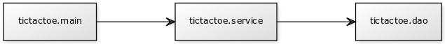
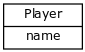
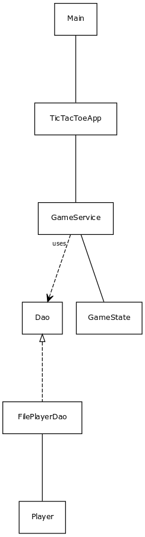
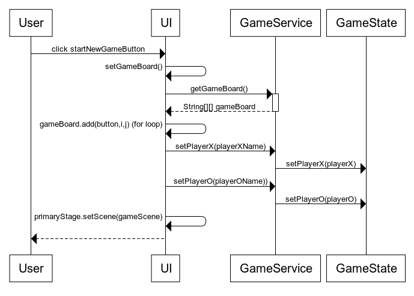

# Arkkitehtuurikuvaus

## Rakenne

Ohjelman rakenne noudattaa perinteistä kolmitasoista kerrosarkkitehtuuria oheisella pakkausrakenteella:

Pakkaus *tictactoe.main* sisältää JavaFX:llä toteutetun käyttöliittymän, *tictactoe.service* sovelluslogiikan ja -palvelun apuluokkineen ja *tictactoe.dao* pysyväistallennuksesta vastaavan koodin.

## Käyttöliittymä

Käyttöliiittymä sisältää kolme näkymää

* Aloitus
* Uuden käyttäjän luominen
* Pelilauta

Jokainen näistä on toteutettu omana JavaFX Scene-oliona. näkymistä aina yksi kerrallaan on näkyvissä, eli sijoitettu sovelluksen stageen. Käyttöliittymä on rakennettu ohjelmallisesti luokassa *tictactoe.main.TicTacToeApp*.

Käyttöliittymä on eristetty täysin sovelluslogiikasta, se kutsuu aina tarvittaessa sovelluslogiikan toteuttavan olion *gameService* metodeja.

## Sovelluslogiikka

Sovelluksen looginen datamalli koostuu luokasta **Player**, josta ilmenee toistaiseksi vain pelaajan nimi. 

Toiminnallisista kokonaisuuksista vastaa luokka **GameService**, tarjoten käyttöliittymän toiminnoille useita metodeja:
* boolean createPlayer(String playerName)
* boolean deletePlayer(String playerName)
* boolean login(String playerName)
* void initGameBoard(int width)
* String[][] getGameBoard()
* void setGameSquare(int i, int j, String chip)
* void changeTurn()
* String checkStatus()
* boolean isTurnX()
* String getPlayerX()
* String getPlayerO()
* void setPlayerX(String playerX)
* void setPlayerO(String playerO)

GameService pääsee käsiksi pelaajiin pakkauksessa tictactoe.dao sijaitsevan rajapinnan **Dao** toteuttavan **FilePlayerDao** luokan kautta. Luokan toteutus injektoidaan GameService luokalle konstruktorikutsun yhteydessä.

Pelin sisäisestä tilanteesta vastaa luokka **GameState**, joka tarjoaa GameServicelle erilaisia pelitilanteen tarkistamiseen ja manipuloimiseen liittyviä metodeja.

Ohjelman luokkien väliset suhteet luokkakaaviona:

## Tiedostojen pysyväistallennus

Pakkauksen *tictactoe.dao* luokka *FilePlayerDao* huolehtii pelaajatietojen tallennuksesta tiedostoihin.

Luokat noudattavat Data Access Object -suunnittelumallia ja voidaan tarvittaessa vaihtaa, jos tallennutapaa haluaa vaihtaa esim. tietokantatallennukseksi. Luokka on eristetty rajapinnan *Dao* taakse ja sovelluslogiikka ei käytä luokkia suoraan.

## Tiedostot

Sovellus tallentaa pelaajien tiedot omaan tiedostoonsa. Sovelluksen juureen sijoitettu config.properties konfigurointitiedosto määrittelee tiedostojen nimet.

Pelaajista tallennetaan toistaiseksi vain nimi ja eri pelaajat erotellaan omille riveilleen.

## Päätoiminnallisuudet

Käyn seuraavaksi tarkemmin läpi mitä ohjelmassa tapahtuu, kun uusi peli käynnistetään ja pelilaudan nappeja painetaan.

### Uuden pelin käynnistys

Käyttäjän painaessa pre-game valikossa nappia *Start new game* etenee sovelluksen kontrolli seuraavasti:

Käyttöliittymän tapahtumankäsittelijä kutsuu ensin omaa metodiaan setGameBoard parametrilla gameService.getGameBoard(), joka käynnistää kutsun GameService luokan metodille getGameBoard(). GameService palauttaa setGameBoard() metodille  jo aikaisemmin alustetun pelilaudan, jonka jälkeen setGameBoard() jatkaa lisäämällä aikaisemmin alustettuun käyttöliittymän GridPane olioon gameBoard tyhjät pelinappulat. Tämän jälkeen kutsutaan GameService luokan metodia setPlayerX() parametrilla, joka sisältää esimääritetyn tai käyttäjän asettaman pelaajan nimen. GameService kutsuu heti tämän jälkeen GameState luokan metodia setPlayerX parametrinaan sama pelaajan nimi, jonka jälkeen GameState asettaa String-tyyppisen luokkamuutujansa playerX arvoksi annetun pelaajan nimen. Sama toistetaan pelaajan O osalta. Lopuksi käyttöliittymän tapahtumakäsittelijä asettaa päänäkymäksi pelinäkymän ja palauttaa kontrollin käyttäjälle.

Todellisuudessa taustalla tapahtuu vielä paljon enemmänkin, sillä setGameBoard metodin kutsuminen käynnistää nappien luonnin lisäksi nappien tilan tarkistamisen, mikä taas johtaa pelitilanteen tarkistamiseen jne. Kaiken tämän kuvaaminen sekvenssikaaviolla menee kuitenkin turhan monimutkaiseksi, mutta käyn kuitenkin seuravassa tarkemmin läpi mitä tapahtuu, kun pelilaudalla vuorossa oleva pelaaja painaa nappia.

### Pelilaudan napin painallus

Peli alkaa aina pelaajan X vuorolla. Kun pelaaja X painaa jotain laudan nappia, ilmestyy klikattuun ruutuun merkki X. Matkan varrella tapahtuu seuraavaa:

Pelilaudan nappulan painallus aktivoi käyttöliittymän metodin setStateFor(Button button, int i, int j), joka puolestaan aktivoi pelilaudan napin tapahtumankäsittelijän. Tapahtumankäsittelijä palauttaa annetun napin takaisin, mikäli se ei ole tyhjä (napille ei siis tehdä mitään, sillä jo pelattua ruutua ei voi muuttaa). Jos nappi on tyhjä (sitä ei ole vielä painettu pelin aikana), tarkistaa tapahtumankäsittelijä ensin GameService luokan metodin isTurnX() avulla onko kyseessä pelaajan X vuoro. Metodi palauttaa käyttöliittymälle boolean arvon, jonka perusteella käyttöliittymä valitsee joko pelaajaa X tai pelaajaa O käsittelevän if-haaran. Molemmissa tapauksissa tehdään seuraavat neljä asiaa:
1. Metodille parametrina annetun Button-olion tekstiksi asetetaan vuorossa olevan pelaajan merkki. 
2. Käyttöliittymä kutsuu GameService luokan metodia setGameSquare() ja annetaan parametreiksi napin koordinaatit ja pelaajan merkki (X tai O). Tämä aktivoi kutsun GameState luokan metodille setGameSquare samoilla parametreilla. Lopulta GameState asettaa oman luokkamuuttujansa gameBoard[i][j] arvoksi annetun pelaajan merkin. 
3. Käyttöliittymä kutsuu GameService luokan metodia changeTurn(). Kyseinen metodi aktivoi GameState luokan metodin isTurnX kutsun, jolla tarkistetaan onko vuoro pelaajalla X vai O. Metodi changeTurn haarautuu nyt joko pelaajan X tai O haaraan. Molemmissa haaroissa kutsutaan ensin GameState luokan metodia setTurnX() ja annetaan parametriksi true tai false pelaajasta riippuen. Tämän jälkeen kutsutaan GameState luokan metodia incrementMovesCount(), joka kasvattaa GameState luokan MovesCount instanssimuuttujaa yhdellä. MoveCount arvoa tarvitaan, jotta tiedetään myöhemmin onko pelilaudan kaikki ruudut pelattu, jolloin tuloksena on tasapeli.
4. Käyttöliittymä kutsuu omaa metodiaan checkStatus, jonka parametreina on X ja O, jos pelivuorossa on pelaaja X. Pelaajan O ollessa vuorossa parametrit annetaan päinvastaisessa järjestyksessä. checkStatus metodi kutsuu ensimmäiseksi GameService luokan metodia checkStatus, mikä puolestaan käynnistää kutsun GameState luokan metodille checkGameStatus. checkGameStatus käynnistää lukuisia eri tarkastustyyppien alitarkistuksia GameStaten check() metodille, joka palauttaa tyhjän merkkijonon, jos tarkistus ei löytänyt pelille voittajaa ja toisaalta pelin voittajan (X tai O) merkkijonon, jos tarkistus löysi voittajan. Lopuksi tarkistetaan vielä onko kaikki pelilaudan ruudut pelattu ja jos on, niin palautetaan merkkijono N. Tieto tarkastuksen tuloksesta kulkeutuu GameService luokan kautta käyttöliittymälle, joka saamansa arvon perusteella vaihtaa pelilaudan yläreunan tekstiä tilanteen mukaan. Jos pelillä on voittaja tai on tullut tasapeli, käyttöliittymän gameBoard olio asetetaan disable-moodiin ja pelilaudan alareunaan asetataan näkyviin gameButtonPane olion sisältämät napit (*New game* ja *Start menu*)   

## Ohjelman rakenteeseen jääneet heikkoudet

* Ohjelman käyttöliittymän eri näkymät on nyt toteutettu kaikki samaan metodiin start. Nämä olisi ehdottomasti eroteltava omiksi metodeikseen tai jopa omiksi luokikseen, jotka voisivat muodostaa myös oman pakettinsa. Koodin tarkastelu ja muokkaaminen käyttöliittymän osalta on nyt melko hankalaa.

* Dao-toteutusten FileNotFoundException haarat ovat jääneet nyt testaamatta automaattisilla testeillä. Jonkinlaisen Mock-ympäristön käyttäminen JUnit-teteissä voisi olla paikallaan.

* JavaFX:n toiminnallisuuteen tutustuminen jäi liian pintapuoliseksi, jonka vuoksi käyttöliittymä jäi melko karun oloiseksi. Lisäksi en ehtinyt selvittämään mistä esim. seuraava kummallisuus johtuu: Ilmeisesti käyttöliittymän logiikasta johtuen jos pelissä aloittaa uuden pelin toisen perään ja pelaa sen loppuun, ilmestyy peliaudalle edellisen pelin lopputilanne käynnissä olevan pelin alle. Käyttöliittymien kaikkien näkymien koodin sijainti samassa metodissa ei ainakaan helpottanut hahmottamaan mistä tämä voisi johtua.