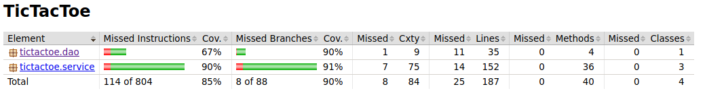
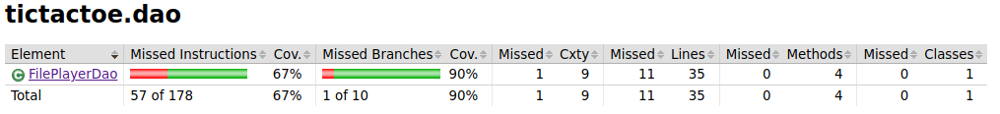

# Testausdokumentti

Ohjelmalle on toteutettu automaattisia JUnit yksikkö- ja integraatiotestejä. Testien rivi- ja haaraumakattavuus on raportoitu JaCoCo:n avulla, josta oheen on liitetty kuvakaappauksia sovelluksen lopullisesta versiosta.

## Testauksen kokonaiskattavuus

Pää- ja käyttöliittymäluokkia ei testata, joten testien rivikattavuus koko sovelluksen osalta on noin 85% ja suurin osa eri haaroista myös testataan.

## Paketin tictactoe.service testit

Tästä paketista löytyy sovelluslogiikasta vastaava luokka GameService, pelitilanteen tarkistamisesta ja manipuloinnista vastaava luokka GameState ja sovelluksen loogisen datamallin ainoa luokka Player. Testien rivikattavuus on koko luokan osalta 90% ja haaraumakattavuus 91%. Puutteet johtuvat suureksi osaksi GameService luokan catch-haaroista.

## Paketin tictactoe.dao testit

Tästä paketista löytyy tallennettujen pelaajien tietoja tiedostossa käsittelevä luokka FilePlayerDao. Testien rivikattavuus on hieman matala 67%, joka johtuu GameService-luokan tavoin testaamattomista catch-haaroista, jotka vastaavat virheviestien tulostamisesta tilanteissa, joissa tiedostoa ei löydy.

## Parannettavaa testauksessa

* En ehtinyt perehtymään miten saisin testattua try/catch haaroja, joita oli erityisesti FilePlayerDao- ja GameService-luokissa. Tämän paikkaamalla voisi varmistua, että ohjelma toimii oikein myös vikatilanteissa.